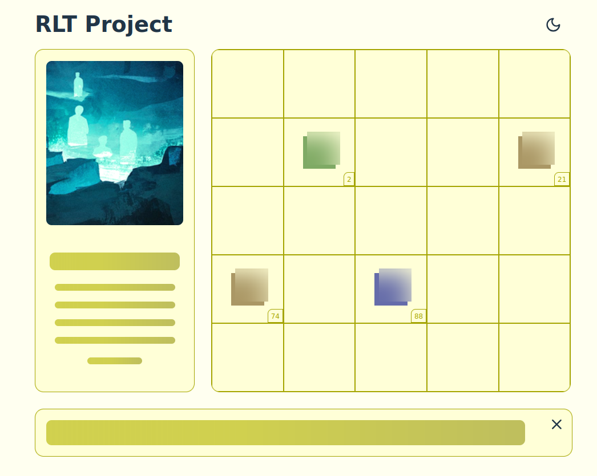

# RLT Agency | Test Project


## Description
This project is a test application developed using Scss, Vue.js, and TypeScript. It serves as a demonstration of building a responsive and interactive user interface with modern front-end technologies.

## Features
- Responsive layout with a sidebar and main content area.
- Dynamic item management with drag-and-drop functionality.
- Modal dialogs for item confirmation and warnings.
- Local storage integration for persistent state management.
- Customizable button sizes and styles.
- Theme toggle for light and dark modes.

## Installation
To get started with the project, follow these steps:

1. Clone the repository:
   ```bash
   git clone https://github.com/yourusername/rlt-project.git
   cd rlt-project